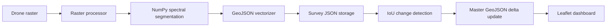

# GeoNex

GeoNex is a FastAPI and Leaflet-based prototype for drone imagery mapping and
incremental geospatial change detection. It was developed for Smart India
Hackathon 2026, Problem Statement 26012.

The application accepts aerial raster images, classifies pixels with a
lightweight NumPy spectral-segmentation pipeline, converts the result to
GeoJSON polygons, compares surveys over time, and applies the detected delta
to a master geospatial database.

## Features

- Process PNG, JPG, and other raster images supported by Pillow/OpenCV.
- Tile and normalize imagery with a 256 x 256 window and 32-pixel overlap.
- Classify water, roads, buildings, and rooftops with the dependency-light
  spectral fallback model in `backend/models/unet_plus_plus.py`.
- Convert segmentation masks into filtered GeoJSON polygons.
- Detect `NEW`, `REMOVED`, and `MODIFIED` features using polygon IoU and area
  change thresholds.
- Store surveys and the master GeoJSON database as local JSON files.
- Explore surveys, layers, and change summaries in the Leaflet dashboard.
- Generate synthetic 2025 and 2026 surveys for a repeatable demonstration.

> **Prototype status:** The project does not currently ship trained neural
> network weights. Despite the historical module name, the default segmentation
> implementation is a deterministic NumPy spectral classifier intended for
> demonstrations and serverless deployment.

## Architecture



### Core modules

| Module | Location | Responsibility |
| --- | --- | --- |
| API and dashboard server | [`backend/main.py`](backend/main.py) | FastAPI routes, static files, and service initialization |
| Raster processor | [`backend/preprocessing/raster_processor.py`](backend/preprocessing/raster_processor.py) | Image loading, normalization, and tiling |
| Segmentation pipeline | [`backend/models/unet_plus_plus.py`](backend/models/unet_plus_plus.py) | NumPy-based spectral class masks |
| GeoJSON vectorizer | [`backend/postprocessing/vectorizer.py`](backend/postprocessing/vectorizer.py) | Contour extraction, simplification, and area filtering |
| Change detector | [`backend/analysis/change_detection.py`](backend/analysis/change_detection.py) | Polygon matching and change classification |
| GeoJSON database | [`backend/database/geodb.py`](backend/database/geodb.py) | Survey storage and master database updates |
| Demo generator | [`backend/utils/sample_generator.py`](backend/utils/sample_generator.py) | Synthetic baseline and current imagery |

## Project structure

```text
.
├── api/index.py                 # Vercel ASGI entry point
├── backend/
│   ├── analysis/                # Polygon change detection
│   ├── database/                # JSON geospatial storage
│   ├── models/                  # Segmentation pipeline
│   ├── postprocessing/          # Raster-to-GeoJSON conversion
│   ├── preprocessing/           # Raster loading and tiling
│   ├── utils/                   # Synthetic survey generation
│   └── main.py                  # FastAPI application
├── data_store/                  # Local survey and master database files
├── static/                      # Dashboard, presentation, CSS, and JS
├── uploads/                     # Local runtime uploads
├── generate_ppt.py              # Optional PowerPoint generator
├── presentation.html            # Standalone presentation
├── pyproject.toml               # Project metadata and dependencies
├── requirements.txt             # Runtime dependency list
├── run.py                       # Local development launcher
└── vercel.json                  # Vercel routing configuration
```

## Local setup

### Requirements

- Python 3.10 or newer
- Git

### Install and run

```powershell
git clone https://github.com/deepak-jalandhra-214/GeoNex_SIH.git
cd GeoNex_SIH

python -m venv .venv
.venv\Scripts\Activate.ps1
python -m pip install --upgrade pip
python -m pip install -r requirements.txt

python run.py
```

On Linux or macOS, activate the environment with:

```bash
source .venv/bin/activate
```

The local server listens on `http://127.0.0.1:8000` and reloads when Python
source files change.

## Using the application

Open these URLs after starting the server:

- Dashboard: <http://127.0.0.1:8000>
- Interactive API documentation: <http://127.0.0.1:8000/docs>
- Presentation: <http://127.0.0.1:8000/slides.html>

For the fastest demonstration, open the dashboard and select **Generate Demo
Data**. This creates baseline survey `survey_2025`, current survey
`survey_2026`, their vector features, change results, and a master database
update.

## REST API

FastAPI also exposes the complete schema at `/docs` and `/openapi.json`.

| Method | Endpoint | Description |
| --- | --- | --- |
| `GET` | `/api/health` | Return service and segmentation status |
| `GET` | `/api/generate-demo-data?style=classic` | Generate and process synthetic surveys. `style` can be `classic` or `presentation` |
| `POST` | `/api/upload-and-process` | Process an uploaded raster and save a survey |
| `GET` | `/api/surveys` | List stored survey metadata |
| `GET` | `/api/surveys/{survey_id}` | Return a survey and its GeoJSON |
| `POST` | `/api/change-detection?t1_id=survey_2025&t2_id=survey_2026` | Compare two surveys |
| `POST` | `/api/update-master-db?t1_id=survey_2025&t2_id=survey_2026` | Apply a survey delta to the master database |
| `GET` | `/api/master-db` | Return the master GeoJSON database |

### Upload example

`/api/upload-and-process` expects a multipart form with these fields:

- `file`: raster image file
- `survey_id`: unique survey identifier
- `survey_title`: display title
- `survey_date`: date string, for example `2026-09-15`

```bash
curl -X POST http://127.0.0.1:8000/api/upload-and-process \
  -F "file=@sample.png" \
  -F "survey_id=survey_2026_custom" \
  -F "survey_title=Custom Survey 2026" \
  -F "survey_date=2026-09-15"
```

## Deployment on Vercel

The repository includes [`vercel.json`](vercel.json) and [`api/index.py`](api/index.py)
for Vercel's Python runtime.

```bash
npm install --global vercel
vercel
```

You can also import the GitHub repository through the Vercel dashboard. The
root route serves the dashboard, while `/api/*` is routed to the FastAPI app.

### Important deployment limitation

Vercel uses `/tmp/geonex` for runtime uploads and JSON data. Serverless
filesystem contents are temporary and may disappear between invocations, so
the local JSON database is suitable for a demo but not durable production
storage. A production deployment should replace `GeoSpatialDatabaseManager`
with persistent object storage or a geospatial database.

## Development notes

- The default change detector uses an IoU threshold of `0.3`.
- Features with an area difference above `15%` are marked as modified.
- Vectorization filters polygons below `12 m2`.
- CORS is currently open to all origins for demonstration purposes; restrict
  `allow_origins` before production use.
- Uploaded files are written to the runtime upload directory and should be
  validated and access-controlled in a production service.

## License

This project is licensed under the [MIT License](LICENSE).
