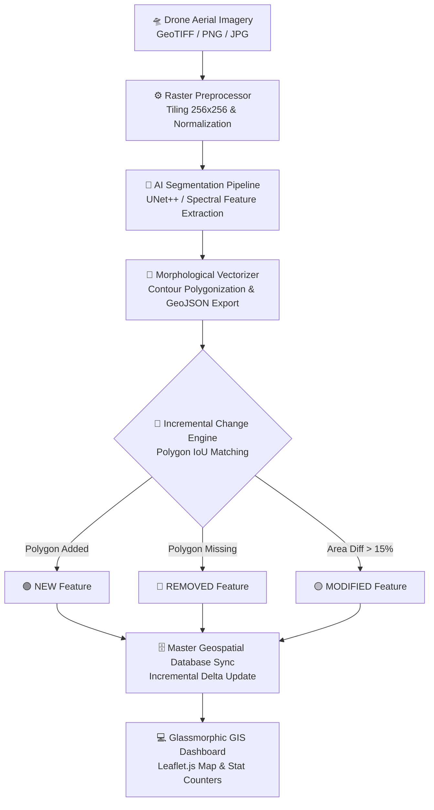

# 🛸 GeoNex — AI Drone Geospatial Mapping & Change Detection Engine

[](https://sih.gov.in)
[](https://www.python.org/)
[](https://fastapi.tiangolo.com/)
[](https://leafletjs.com/)
[](https://vercel.com/)
[](LICENSE)

> **Smart India Hackathon 2026** • **Problem Statement ID: 26012**  
> *Autonomous aerial drone image vectorization, multi-class feature extraction, incremental change detection, and automated cadastral database delta updating.*

---

## 📌 Table of Contents

- [🌟 Executive Summary \& Overview](#-executive-summary--overview)
- [✨ Key Capabilities](#-key-capabilities)
- [📐 Technical Architecture \& Pipeline](#-technical-architecture--pipeline)
- [🧩 Pipeline Core Modules](#-pipeline-core-modules)
- [📂 Repository Structure](#-repository-structure)
- [🚀 Quick Start \& Installation](#-quick-start--installation)
- [💻 Interactive Web Dashboard \& Presentation](#-interactive-web-dashboard--presentation)
- [🔌 Complete REST API Reference](#-complete-rest-api-reference)
- [🌐 Zero-Config Vercel Deployment](#-zero-config-vercel-deployment)
- [🏆 SIH 2026 Alignment \& Impact](#-sih-2026-alignment--impact)
- [📄 License \& Authors](#-license--authors)

---

## 🌟 Executive Summary & Overview

**GeoNex** is an end-to-end, AI-powered Web GIS & Geospatial Automation Platform designed to eliminate manual map digitization bottlenecks for urban planning, revenue departments, and land records administration.

By processing high-resolution drone orthophotos (GeoTIFF / PNG / JPG), GeoNex:
1. **Extracts Vector Features**: Automatically segments aerial rasters into multi-class OGC GeoJSON polygons (Buildings, Roads, Water Bodies, Rooftops).
2. **Detects Temporal Urban Changes**: Performs spatial Intersection over Union (IoU) polygon comparison between baseline (e.g., Survey 2025) and new aerial surveys (e.g., Survey 2026).
3. **Applies Delta Syncs**: Dynamically modifies and patches only altered property parcels inside a central Master Geospatial Database.

---

## ✨ Key Capabilities

- **🛸 Drone Raster Preprocessing & Tiling**
  - Handles multi-gigabyte aerial orthophotos.
  - Applies tile sliding window segmentation (256x256 tiles with 32px overlap), matrix color normalization, and spatial boundary preservation.

- **🧠 Multi-Class AI Feature Segmentation**
  - Custom UNet++ / Spectral-Neural feature extraction pipeline.
  - Classifies urban features across multiple land cover classes (Buildings `#FF5722`, Roads `#3F51B5`, Water Bodies `#00BCD4`, Greenery/Rooftops `#4CAF50`).

- **📐 Morphological Raster-to-GeoJSON Vectorizer**
  - Removes small area noise contours (`min_polygon_area = 12m²`).
  - Polygonizes mask contours into standard WGS84 / Projected OGC GeoJSON FeatureCollections.

- **🔄 AI Incremental Change Engine**
  - Spatial indexing and polygon IoU diffing.
  - Automatically tags parcel changes into:
    - 🟢 **NEW**: Added structures in latest survey (Green `#00E676`)
    - 🔴 **REMOVED**: Demolished or removed structures (Red `#FF1744`)
    - 🟡 **MODIFIED**: Existing features with footprint area shift >15% (Yellow `#FFEA00`)

- **🗄️ Master Geospatial Database Sync**
  - Avoids full database overwrites. Performs spatial delta updates to update modified parcel records while retaining untouched historical GIS data.

- **🎨 Glassmorphic Interactive GIS Dashboard**
  - Premium modern UI featuring Leaflet cartography, layer visibility toggles, dynamic parcel counter pills, inspect modals, and built-in SIH presentation slide deck.

---

## 📐 Technical Architecture & Pipeline



---

## 🧩 Pipeline Core Modules

| Module | Location | Primary Responsibility |
|---|---|---|
| **Raster Preprocessor** | [`backend/preprocessing/raster_processor.py`](file:///c:/Users/Laptop%20Solution/OneDrive/github/pandrive/sih/backend/preprocessing/raster_processor.py) | Image ingestion, spatial tiling (256x256), sliding window matrix slicing, and RGB/spectral normalization. |
| **AI Segmentation Pipeline** | [`backend/models/unet_plus_plus.py`](file:///c:/Users/Laptop%20Solution/OneDrive/github/pandrive/sih/backend/models/unet_plus_plus.py) | Executes neural & multi-spectral thresholding to produce pixel-level classification masks. |
| **GIS Vectorizer** | [`backend/postprocessing/vectorizer.py`](file:///c:/Users/Laptop%20Solution/OneDrive/github/pandrive/sih/backend/postprocessing/vectorizer.py) | OpenCV contour detection, polygon simplification, area filtering, and GeoJSON formatting. |
| **Change Detection Engine** | [`backend/analysis/change_detection.py`](file:///c:/Users/Laptop%20Solution/OneDrive/github/pandrive/sih/backend/analysis/change_detection.py) | Shapely polygon IoU diff engine, detecting new constructions, demolitions, and footprint shifts (>15%). |
| **GeoSpatial DB Manager** | [`backend/database/geodb.py`](file:///c:/Users/Laptop%20Solution/OneDrive/github/pandrive/sih/backend/database/geodb.py) | Atomic filesystem/JSON geospatial storage, survey versioning, and Master DB delta sync. |
| **Synthetic Data Generator** | [`backend/utils/sample_generator.py`](file:///c:/Users/Laptop%20Solution/OneDrive/github/pandrive/sih/backend/utils/sample_generator.py) | Procedurally generates realistic 2025 baseline and 2026 current drone orthophotos for instant demonstration. |

---

## 📂 Repository Structure

```text
GeoNex_SIH/
├── api/
│   └── index.py               # Vercel Serverless Function entrypoint
├── backend/
│   ├── analysis/              # IoU Polygon Change Detection Engine
│   │   └── change_detection.py
│   ├── database/              # Spatial Database Manager & Master Delta Sync
│   │   └── geodb.py
│   ├── models/                # Multi-class AI Segmentation Pipeline
│   │   └── unet_plus_plus.py
│   ├── postprocessing/        # Contour-to-GeoJSON Vectorization Engine
│   │   └── vectorizer.py
│   ├── preprocessing/         # Raster Tiling & Array Loader
│   │   └── raster_processor.py
│   ├── utils/                 # Synthetic Aerial Image Generator
│   │   └── sample_generator.py
│   └── main.py                # FastAPI Application & API Router
├── data_store/                # GeoJSON storage for Surveys & Master GIS DB
├── static/
│   ├── css/
│   │   └── styles.css         # Modern Glassmorphic Dark UI Design System
│   ├── js/
│   │   └── app.js             # Leaflet.js Interactive Controller & API integration
│   ├── index.html             # GIS Dashboard Web App
│   └── slides.html            # Embedded SIH 2026 Presentation Deck
├── generate_ppt.py            # Automated PowerPoint (.pptx) Deck Builder
├── presentation.html          # Standalone Interactive HTML Pitch Deck
├── pyproject.toml             # Headless Python Project Configuration
├── requirements.txt           # Python dependencies for Serverless & Local runtimes
├── vercel.json                # Vercel routing rules & build configuration
└── run.py                     # Local Server Launcher Script
```

---

## 🚀 Quick Start & Installation

### Prerequisites
- **Python 3.10** or higher installed
- **Git**

### 1. Clone & Setup Virtual Environment

```powershell
# Clone the repository
git clone https://github.com/deepak-jalandhra-214/GeoNex_SIH.git
cd GeoNex_SIH

# Create virtual environment
python -m venv .venv

# Activate Virtual Environment (Windows PowerShell)
.venv\Scripts\Activate.ps1

# On Linux / macOS:
# source .venv/bin/activate
```

### 2. Install Dependencies

```powershell
python -m pip install --upgrade pip
pip install -r requirements.txt
```

### 3. Launch Application

```powershell
python run.py
```

---

## 💻 Interactive Web Dashboard & Presentation

Once the server is running, access the following URLs in your browser:

- 🗺️ **GIS Web Dashboard**: [`http://127.0.0.1:8000`](http://127.0.0.1:8000)
- 📊 **Swagger API Docs**: [`http://127.0.0.1:8000/docs`](http://127.0.0.1:8000/docs)
- 📽️ **Interactive Presentation Deck**: [`http://127.0.0.1:8000/slides.html`](http://127.0.0.1:8000/slides.html)

### Demonstration Workflow (Quick Test)
1. Open the **GIS Web Dashboard**.
2. Click **⚡ Generate Demo Data** in the top navigation bar.
3. GeoNex instantly generates a 2025 baseline drone survey and a 2026 new survey, executes AI vectorization, compares parcel changes, and syncs the Master Geospatial Database!
4. Use the layer control toggles to view **Baseline 2025**, **Current 2026**, **Change Diffs (Green/Red/Yellow)**, and the updated **Master GeoDB**.

---

## 🔌 Complete REST API Reference

| Method | Endpoint | Description | Request Payload / Params |
|---|---|---|---|
| `GET` | `/api/health` | Service health status & active device model check | N/A |
| `GET` | `/api/generate-demo-data` | Procedurally generates 2025 & 2026 aerial rasters, runs segmentation & change detection | N/A |
| `POST` | `/api/upload-and-process` | Uploads aerial drone raster image & returns vector GeoJSON | `file` (UploadFile), `survey_id`, `survey_title`, `survey_date` |
| `GET` | `/api/surveys` | Retrieves list of all stored aerial survey metadata | N/A |
| `GET` | `/api/surveys/{survey_id}` | Fetches full GeoJSON feature collection for a survey | `survey_id` (path parameter) |
| `POST` | `/api/change-detection` | Performs polygon IoU change detection between Survey T1 & T2 | `t1_id` (default: `survey_2025`), `t2_id` (default: `survey_2026`) |
| `POST` | `/api/update-master-db` | Applies detected change deltas to Master Cadastral GeoDB | `t1_id`, `t2_id` |
| `GET` | `/api/master-db` | Fetches the complete Master Cadastral GeoJSON | N/A |

---

## 🌐 Zero-Config Vercel Deployment

GeoNex is pre-configured for instant deployment on Vercel Serverless Functions using `api/index.py` and lightweight Python packages (`opencv-python-headless`).

### Deploy via Vercel CLI
```bash
npm i -g vercel
vercel
```

### Deploy via GitHub Integration
1. Push your repository to GitHub.
2. Import the project into your [Vercel Dashboard](https://vercel.com/dashboard).
3. Vercel automatically detects `vercel.json` and `api/index.py` to launch the API and static web app globally!

---

## 🏆 SIH 2026 Alignment & Impact

- **Problem Statement ID**: 26012 — *Smart Automation for Urban Cadastral Mapping & Change Analytics*
- **Target Beneficiaries**: Survey of India, State Revenue & Land Records Departments, Municipal Corporations, Urban Development Authorities.
- **Key Business Impact**:
  - Reduces manual aerial photo digitization from weeks to **seconds**.
  - Eliminates full database rebuilds by implementing **incremental spatial delta updates**.
  - Provides clear visual audit trails of unauthorized construction and urban land expansion.

---

## 📄 License & Authors

This project is open-source software licensed under the [MIT License](LICENSE).

Developed for **Smart India Hackathon 2026**.
